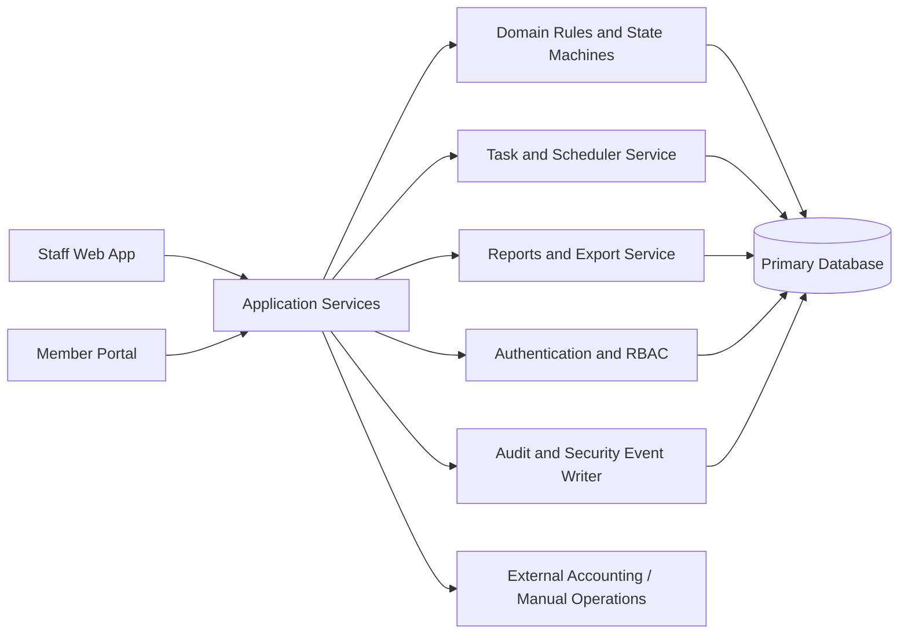
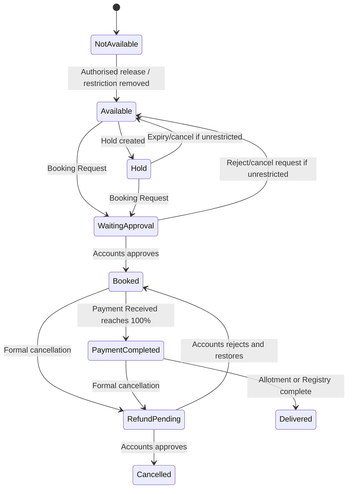
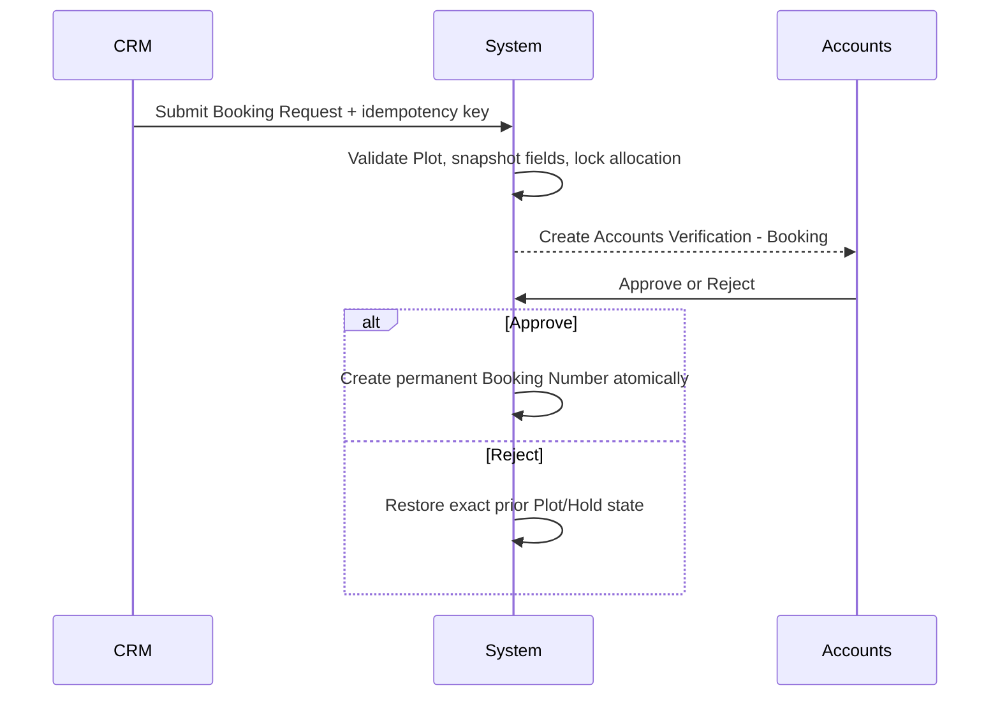

# 3% Club CRM v3.1 — Architecture

**Status:** Final technical architecture companion to the corrected v3.1 PRD  
**Date:** 19 August 2026  
**Document owner:** 3% Club / Thirty Milestones LLP  
**Read with:** [`PRD.md`](./PRD.md)

---

## 1. Authority and Interpretation

1. `PRD.md` contains the binding business rules.
2. This file translates those rules into an implementation architecture.
3. Where this file conflicts with `PRD.md`, `PRD.md` controls.
4. Version 3.0 remains the full product baseline except where corrected v3.1 expressly changes or adds a rule.
5. No developer may use an older draft or existing code behavior to restore a removed rule.
6. Any unresolved ambiguity must become a numbered Change Request before implementation.

---

## 2. System Context

The product is a responsive CRM for plotted real-estate operations with:

- Staff web application
- Restricted Member portal
- Projects and Plot Inventory
- Enquiries, Holds and Booking Requests
- Approved Bookings and percentage-only Payment Received tracking
- Buyback/Purchase for Resale and percentage-only Payment Given tracking
- Direct, Invite, Royalty, Loyalty and Buying Commission control
- Dashboard tasks, reports, audit, permissions and scheduled jobs

### 2.1 External boundaries

The CRM does **not** become:

- A rupee accounting ledger
- A payment gateway
- A bank reconciliation platform
- A Customer portal
- A document-storage system for scanned KYC, agreements or registry files
- A standalone quotation calculator
- A marketing-automation platform

All rupee values and statutory accounting remain outside the CRM. The CRM stores percentages, statuses, dates, references, beneficiaries, relationships and audit facts.

### 2.2 Primary actors

| Actor | Architectural boundary |
|---|---|
| MD | Highest authority, exceptional corrections, recovery governance |
| Admin | Users, projects, restrictions, Member activation, controlled corrections |
| Accounts | Booking decisions, payment confirmation/correction, bank verification, commission processing |
| CRM | Enquiries, Holds, Booking Requests, follow-up and workflow initiation |
| MIS | Masked reporting and authorised manual tasks |
| PC | Project/Plot preparation within permission |
| Member | Restricted portal and own approved records only |
| System | Deterministic enforcement of approved rules |

---

## 3. Architectural Principles

### 3.1 One Person, multiple capabilities

Use one immutable `Person` identity. A Person may have one or more capabilities:

- Enquiry person
- Customer
- Member
- Seller
- Final registration buyer
- Staff

Customer ID, Member ID and Staff Account ID are display/business identities linked to the same Person, not separate human records.

### 3.2 Append-only protected history

The following must never be silently overwritten or hard-deleted:

- Booking review versions
- Plot lifecycle and restriction changes
- Payment Received and Payment Given entries
- Payment corrections
- Commission eligibility and payment records
- Primary Customer and ownership-share changes
- External references
- Acquisitions and Buybacks
- Audit and security events

Corrections create a new event or replacement record and preserve the original.

### 3.3 Exact state transitions

Every state change must be implemented through a domain service/state transition, not by directly editing status fields.

Each transition must validate:

- Current state
- Requested next state
- Role and record scope
- Required fields
- Maker-checker separation
- Active conflicting process
- Idempotency key
- Database uniqueness/concurrency conditions

### 3.4 Percentage-only financial boundary

Persist exact decimal percentages. Do not persist deal price, payment amount, commission amount, refund amount, TDS or payout value.

Use exact decimal arithmetic, not binary floating point, for:

- 100% schedule validation
- 4% commission cap
- Payment Received/Given progress
- PLC percentage
- Ownership-share total

---

## 4. Logical Component Architecture

### 4.1 Presentation layer

- Staff web application with role-aware navigation
- Member portal in a separate security context
- Server-rendered or API-backed pages with no client-only authorisation
- Responsive layouts for desktop, tablet and mobile browser

### 4.2 Application services

Recommended service boundaries:

- Identity and Person Service
- Customer Service
- Member and Network Service
- Project and Plot Service
- Enquiry Service
- Hold and Hold Request Service
- Booking Service
- Payment Received Service
- Payment Given Service
- Commission Service
- Cancellation Service
- Change Plot Service
- Acquisition Service
- Allotment/Registry Service
- Task Service
- Reporting/Export Service
- Authentication and Permission Service
- Audit Service

### 4.3 Domain rule layer

Business rules should be centralised and reusable. Pages must not contain independent copies of critical rules such as:

- Plot return logic
- Three-open-position calculation
- Commission compatibility and 4% cap
- Invite/Royalty/Loyalty slot allocation
- Payment milestone calculation
- Restriction handling
- Maker-checker validation
- Major conflicting-process validation

### 4.4 Persistence layer

Use a relational database with:

- Foreign keys
- Unique and partial unique constraints
- Exact decimal columns
- Transaction isolation/row locking for contested records
- Append-only history tables
- Immutable audit-event storage
- Indexed search fields and protected blind/normalised identity indexes where applicable

---

## 5. Minimum Logical Data Model

The names below are logical. The vendor may choose naming conventions, but the represented boundaries are mandatory.

### 5.1 Identity and access

#### Person

- Internal UUID
- Name
- Contact mobile(s)
- City/address fields as approved
- Aadhaar protected value, last four and status
- PAN protected value/normalised value and status
- Merge status and surviving Person link

#### CustomerProfile

- Customer ID
- Customer Type
- Original Introduced By Member
- Introduced Customer position/rate snapshot
- Primary Relationship CRM where implemented
- Loyalty consumed-slot summary derived from qualifying events

#### MemberProfile

- Member ID
- Activation date
- Status
- Invited By Member
- Invited Member annual position/rate snapshot
- Introduced Customer counter metadata
- RERA fields
- Portal access state

#### PersonMergeEvent

- Surviving Person
- Merged (duplicate) Person
- Actor
- Date/time
- Reason
- Moved capabilities list
- Old Customer ID and Member ID preserved as searchable historical references
- Loyalty count rebuild record (unique qualifying events only)

#### StaffAccount

- Staff Account ID
- Linked Person
- Role(s) and scoped permissions
- Active/Disabled state
- MFA state where required
- Session invalidation/version

#### PortalAccount

- Linked Member
- Member ID login identifier
- Password hash
- Enabled/Disabled
- Session/security metadata

### 5.2 Sales and inventory

#### Project

- Project ID
- Name, developer, location
- Project Type
- Internal lifecycle: Setup/Not Active, Active, Sold Out, Completed
- Derived Available (Resale) display condition
- PLC rule-version reference

#### Plot

- Plot ID
- Project
- Plot Type and Plot Number
- Dimensions and exact-area override
- Derived areas
- Boundary details
- Park Facing/open-side data
- Lifecycle state
- Restriction state and reason
- RESALE flag
- Current active allocation reference

Database uniqueness:

> Project + Plot Type + Plot Number

#### PlcRuleVersion / PlcSnapshot

- Project
- Effective version
- Distinct PLC components and percentages
- Snapshot payload linked to Hold, Booking Request or Change Plot

#### Enquiry

- Enquiry ID
- Person
- Project and optional Plot
- Source and source Person
- Assigned CRM
- Status and close reason
- Next follow-up

Active duplicate controls:

- One Active Enquiry for same Person + Project + Plot
- One Active General Enquiry for same Person + Project + no Plot

#### Hold

- Plot
- Actual Customer/Person
- Source context
- Start/expiry
- PLC snapshot
- Extension count/history
- Status

#### HoldRequest

- Member
- Customer/Person
- Plot
- Created timestamp
- Working-day expiry
- Status

Unique active rule:

> One Pending Hold Request for the same Customer and Plot

### 5.3 Booking and payment

#### Booking

- Internal Booking ID
- Booking Request ID
- Permanent Booking Number after Accounts approval
- Current Booking state
- Project/Plot
- Primary Customer
- Sold By type and Person
- Booking date
- Current PLC snapshot
- Current payment schedule version
- Current review version

#### BookingReviewVersion

Immutable submission snapshot containing:

- Primary/Additional Customers
- Ownership shares
- Project/Plot
- PLC snapshot
- Sold By and beneficiary
- Booking Date
- Customer Type
- Payment schedule
- Remark
- Submission and Accounts decision

#### BookingParty / OwnershipShare

- Booking
- Person
- Primary/Additional role
- Commercial Customer vs final registration buyer distinction
- Share percentage
- Effective history

#### PaymentScheduleVersion

- Booking/acquisition
- Version
- Instalments and percentages
- Reason and actor
- Effective dates

#### PaymentReceivedEntry

- Booking
- Incremental percentage
- Date
- External Reference
- Original/correction linkage
- Status

#### PaymentGivenEntry

- Acquisition
- Incremental percentage
- Date
- External Reference
- Original/correction linkage
- Status

Global active External Reference uniqueness applies across both Payment Received and Payment Given after normalisation.

#### ExternalReference

- Reference number and normalised key
- Purpose
- Action date
- Entry timestamp
- Active/Superseded
- Replacement linkage
- Reason

### 5.4 Commission and acquisition

#### CommissionRecord

- Booking/acquisition
- Beneficiary Person and role
- Type: Direct, Invite, Royalty, Loyalty, Buying
- Percentage and rule version
- Milestone
- Eligibility state
- Payment state
- Current Record flag
- Effective From/To
- Superseded By
- External Processing Completed

Unique current-record rule:

> One current record per Booking/acquisition + commission type + beneficiary role

#### CommissionOpportunity

Atomic entitlement tracking for:

- One Invite opportunity per invited Member
- One Royalty opportunity per introduced Customer
- Up to three Loyalty slots per Customer

#### Acquisition

- Type: Buyback or Purchase for Resale
- Plot/property reference
- Seller/previous Customer
- Arranged By
- Payment Given schedule/progress
- Status
- External Resale Property Group when applicable
- Buying Commission proposal/approval

#### ExternalResalePropertyGroup

- Actual property/project name
- Location
- Project Type
- Source = External Acquisition
- RESALE-only behavior
- Cannot release unrelated inventory; not a fake normal development Project

### 5.5 Work, automation and audit

#### Task

- Record and purpose key
- Assignee
- Due date
- Pending/Completed
- Revision/history
- System/manual origin

Unique task rule:

> Only one Pending task for the same Record + Purpose

#### IdempotencyRecord

- Idempotency key
- Actor/session
- Operation name
- Request hash
- Result reference
- Created/expiry time

#### ScheduledJobRun

- Job type
- Scheduled and actual run time
- Last successful cursor/window
- Status
- Retry count
- Error details

#### AuditEvent / SecurityEvent

- Actor
- Time
- Entity/action
- Masked before/after
- Reason
- Correlation ID
- Session/IP/device where relevant

---

## 6. State and Workflow Architecture

### 6.1 Plot lifecycle

A Plot return must always use the central restriction-aware return function:

- No active Not for Sale/Pledge restriction → Available
- Active restriction → Not Available with restriction

RESALE tagging is independent of availability.

### 6.2 Booking review version

Pending review fields are immutable. A change cancels the review version and creates a new one.

### 6.3 Major conflicting processes

Only one of the following may be active for a Booking:

- Refund Pending
- Change Plot Pending
- Buyback Pending
- Primary Customer Change Under Review
- Sold By Correction Under Review
- Management Action Required (raised when a Payment Given correction creates an irreconcilable conflict with an active buyer process)

The server must reject incompatible transitions even if a button is hidden in the UI.

### 6.4 Commission state separation

Eligibility state:

- Milestone Pending
- Ready
- On Hold

Payment state:

- Not Paid
- Paid
- Paid Early — remarks
- Accounts Adjustment Required
- Cancelled

These are separate axes. A Paid Early record may remain Milestone Pending or On Hold until normal conditions are satisfied.

---

## 7. Transaction and Concurrency Boundaries

Use database transactions and row/advisory locking for:

- Hold creation and Member Hold approval
- Booking Request submission
- Booking approval/rejection/cancellation
- Payment Received/Given confirmation and correction
- Change Plot submission/decision
- Primary Customer and Sold By correction
- Acquisition approval/cancellation
- Commission opportunity allocation
- Commission payment
- Allotment/Registry completion
- Person merge

### 7.1 Required database protections

- One active commercial allocation per Plot
- One active acquisition per Plot/property
- One Pending same-Customer/same-Plot Hold Request
- One current commission component per applicable key
- One Invite opportunity consumption per invited Member
- One Royalty opportunity consumption per introduced Customer
- Maximum three Loyalty slot consumptions per Customer
- Exact ownership-share total = 100% when multiple buyers exist
- Sale commission total ≤ 4%

### 7.2 Tie-breaking

For simultaneous commission milestones:

1. Earliest verified 100% Payment Received timestamp
2. If equal, lower permanent Booking Number

The decision and competing attempt must be auditable.

---

## 8. Idempotency

Critical commands require a client-generated or server-issued idempotency key.

Minimum retention: 24 hours.

A repeated key must return the original result and must not create a second:

- Hold
- Booking Request/Booking Number
- Payment entry
- External Reference
- Commission record/payment
- Task
- Acquisition
- Audit side effect

The idempotency store should also retain an operation/request hash so the same key cannot be reused for materially different input.

---

## 9. Authentication, Authorisation and Sensitive Data

### 9.1 Authentication

- Minimum 10-character password
- Secure password hash only
- MFA mandatory for MD/Admin
- Staff and Member sessions are separate security contexts
- Member login uses Member ID
- Generic invalid-login response
- Rate limiting by IP and account identifier
- Password reset invalidates sessions

### 9.2 Authorisation

Enforce on every request:

- Role permission
- Record scope
- Field scope
- Maker-checker difference
- Sensitive-field permission
- Current account status

Deny by default.

### 9.3 Sensitive data

- Aadhaar and PAN protected at rest
- Normal UI shows only masked values
- Full Aadhaar only for specifically authorised MD/Admin and every access logged
- Full bank only for authorised Accounts/Admin/MD
- Exports never include full Aadhaar, PAN, bank account, password or secret credentials

---

## 10. Scheduled Jobs Architecture

Jobs run in Asia/Kolkata and must be idempotent, observable and catch up after downtime.

| Job | Domain behavior |
|---|---|
| Hold Expiry | Expire at exact stored expiry |
| Member Hold Request Expiry | Apply configured working-day/cut-off calendar |
| Instalment Overdue | Remaining balance becomes Overdue the day after due date |
| Payment Received Reminder | One rolling task seven days before next unpaid due date |
| Payment Given Reminder | One rolling task seven days before next unpaid due date |
| Booking Decision Alert | Red after seven calendar days without decision |
| RERA Expiry Reminder | One task seven days before expiry |
| Annual Counter Reset | Member Activation Date anniversary; new introductions only |

Every job stores:

- Last successful run/cursor
- Records processed
- Created/updated count
- Error and retry information
- Correlation ID

---

## 11. Reporting and Export Architecture

- Operational reports query current live data.
- Payment Received and Payment Given remain separate datasets/columns.
- Commission totals include only current, non-superseded records.
- Merged Persons are not double-counted.
- Exports are masked and logged with report, filters, user, timestamp and row count.
- Optional export hash supports integrity verification.
- The CRM need not retain full historical copies of every export unless separately approved.

---

## 12. Deployment and Operations

Minimum environment model:

- Development
- Test
- Staging
- Production

Controls:

- Synthetic or masked non-production data
- Company-controlled repository, hosting, domain, backups and credentials
- Automated error/job/security monitoring
- Daily encrypted backups with at least 30 rolling days
- Quarterly restoration test
- Target RPO 24 hours
- Target RTO 8 hours
- Release notes and rollback plan for every production deployment

---

## 13. Migration Architecture

Migration from the existing implementation must:

1. Create a production backup and staging copy.
2. Map all legacy statuses into approved v3.0/v3.1 states.
3. Reconcile every Plot to one active allocation.
4. Reconcile Booking/Plot state pairs.
5. Separate Payment Received and Payment Given.
6. Convert commission data into separate eligibility and payment states.
7. Rebuild current/superseded commission links.
8. Rebuild Invite, Royalty and Loyalty opportunities without renumbering valid historical positions.
9. Preserve all IDs and history.
10. Disable old Customer portal access without deleting security history.
11. Reconcile merged/duplicate Persons.
12. Produce a signed record-count and exception report.

---

## 14. Architecture Acceptance Evidence

Before go-live, the vendor must provide:

- Entity relationship/data dictionary
- Permission matrix mapped to server endpoints/actions
- State-transition matrix
- Database constraint list
- Transaction/concurrency test evidence
- Idempotency test evidence
- Scheduler retry/catch-up evidence
- Backup restoration evidence
- Migration reconciliation report
- Security and sensitive-access test evidence
- Requirement-to-test traceability to `PRD.md`
